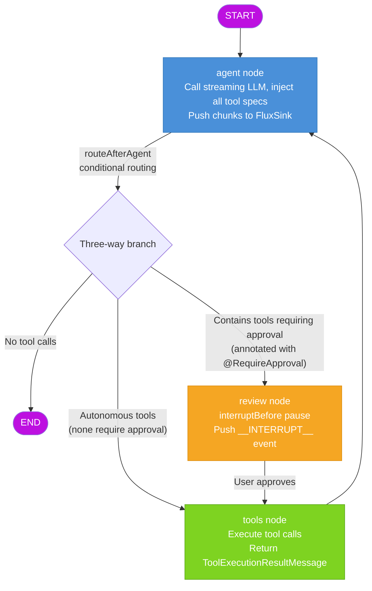

# springAI-Langchain-Agent

> Give any Java project Agent capabilities in minutes — knowledge-base Q&A, tool calling, human approval, import and go.

An Agent orchestration framework built on **Spring Boot 3.5 + LangChain4j 1.18 + LangGraph4j**. No dialog flow is hardcoded — the LLM autonomously decides when to search the knowledge base, when to call tools, and when to pause for human confirmation. A **LangGraph4j state graph** drives the tool-calling loop with checkpoint-based interrupt/resume, so a single chat entry point covers business Q&A, tool invocation, and everyday chitchat.

## Core Features

**LangGraph4j State-Graph Orchestration** — Not a simple AiServices implicit ReAct loop, but an explicit state graph controlling every step: `agent → conditional routing → tools/review → agent` cycle. State between nodes is transparent and inspectable; interrupts are recoverable.

**Human-in-the-Loop (HITL)** — Annotate sensitive tools with `@RequireApproval` and the Agent automatically pauses before execution, waiting for user confirmation. Interrupt state is persisted to Redis, supporting cross-instance recovery.

**Hybrid Retrieval + Score Fusion** — Vector search (Top15) and BM25 keyword search (Top5) run in parallel. Scores are min-max normalized and fused with weighted blending, balancing semantic understanding and exact matching.

**Dual-Constraint Chat Memory** — Caps both message count (100) and token estimation (30K) simultaneously, trimming whichever bound is hit first. Memory is stored in Redis, isolated per session.

**Streaming Output + Task Cancellation** — `Flux<String>` pushes chunks in real time with sub-second first-token latency. Users can interrupt an in-progress Agent task at any time; memory is rolled back on cancellation.

**Input Security** — Five-dimensional regex detection for prompt-injection attacks (instruction override, role confusion, delimiter injection, prompt extraction, encoding bypass). Hits are blocked before reaching the model.

## Graph Orchestration Flow

The core of the Agent is a LangGraph4j state graph with three nodes and a three-way conditional edge:



**Routing logic**: If the LLM-generated `AiMessage` has no tool calls → exit directly; if all tools are autonomous → go to tools without interrupting; if any tool is annotated with `@RequireApproval` → route to review and pause for user confirmation.

**Interrupt and resume**: The graph pauses before the review node via `interruptBefore`. The checkpoint (containing full message state) is persisted to Redis. The frontend receives an `__INTERRUPT__` event and shows a confirmation dialog. On approval, the resume endpoint is called and the graph continues: review → tools → agent. On rejection, a denial feedback is injected for the LLM to re-strategize.

**Checkpoint lifecycle**: Old checkpoints are cleared when a new question arrives. During execution, the checkpoint supports resume on interrupt. After normal completion, the final reply is extracted into memory before the checkpoint is cleared — ensuring no state leaks between sessions.

## Core Logic

### Agent Orchestration Service

`AgentOrchestrationService` is the scheduling hub of the entire framework. It holds the compiled `CompiledGraph` and manages three core flows:

- **orchestrate** (new message): Load session memory → assemble `[SystemMessage] + history` → clear stale checkpoint → start graph execution → stream LLM output → detect review interrupt and push `__INTERRUPT__` event → on normal completion, extract final AiMessage into memory
- **resume** (recover from interrupt): Restore graph state from Redis checkpoint → inject denial `ToolExecutionResultMessage` if rejected → continue execution: review → tools → agent → store final reply to memory → clear checkpoint
- **handleStop** (user cancellation): Roll back UserMessage from memory → clear checkpoint → push `__STOPPED__` event

The agent node generates responses via `StreamingChatModel.chat()`, pushing each chunk in real time to a `FluxSink`. An `AtomicInteger` accumulates token counts across threads. The tools node iterates through `ToolExecutionRequest` lists, checking the cancellation flag before each execution.

### Tool System

Tools are plain `@Tool` methods on a Spring `@Component`, auto-scanned and registered. During `AgentOrchestrationService` construction, reflection extracts all `@Tool` method specifications and `DefaultToolExecutor` instances, while checking for `@RequireApproval` annotations to build the authorization-required tool set used by conditional routing.

Adding a new tool is just one method in the `Tools` class — no orchestration logic changes needed. The project ships with 7 built-in tools: 5 weather tools (autonomous), 1 knowledge-base search (autonomous), 1 employee count query (requires approval).(I just made up all these tools!!)

### Hybrid Retrieval

`CompositeContentRetriever` combines two retrievers running in parallel:

- **Vector search** (`NativeScriptScoreContentRetriever`): ES `script_score` cosine similarity, Top15, minScore=0.2
- **Keyword search** (`KeywordMatchContentRetriever`): ES BM25 match, Top5

Results from both paths are min-max normalized and fused with 0.6/0.4 weighting, then boosted for title and file-name hits before re-ranking. The final Top5 is returned to the LLM.

### Chat Memory

`DualConstraintChatMemory` implements LangChain4j's `ChatMemory` interface with dual constraints: message count (100, ~50 Q&A rounds) and token estimation (30K). On each `add`, oldest messages are evicted FIFO until both constraints are satisfied. Token estimation uses a character-level heuristic: CJK characters = 1.5 tokens, ASCII = 0.25 tokens, plus 4 tokens structural overhead per message.

The underlying `RedisChatMemoryStore` uses `StringRedisTemplate` with key `chat:memory:{sessionId}`, serialized via LangChain4j's `ChatMessageSerializer`. The `removeLastMessage()` method rolls back the UserMessage on task cancellation.

### Checkpoint Persistence

`RedisCheckpointSaver` implements LangGraph4j's `BaseCheckpointSaver` interface, storing Base64-encoded checkpoint lists in Redis Strings. It shares an `ObjectStreamStateSerializer` (with registered `ChatMessageSerializer` and `ToolExecutionRequestSerializer`) to ensure LangChain4j message types serialize correctly. The `release` method deletes all checkpoint data for a thread, used for session cleanup.

### Input Security

`InputSanitizer` scans user input with regex before it reaches the model, covering five classes of prompt-injection attacks: instruction override ("ignore previous instructions"), role confusion (impersonating system role), delimiter injection (`###instructions`), prompt extraction ("output your system prompt"), and encoding bypass (base64 decode). Hits throw `IllegalArgumentException` and are blocked. The sanitizer also strips zero-width characters, compresses newlines, and truncates oversized input.

## Tech Stack

| Layer | Technology | Version |
|-------|-----------|---------|
| Framework | Spring Boot | 3.5.7 |
| AI Framework | LangChain4j | 1.18.1 |
| Graph Orchestration | LangGraph4j | 1.8.17 |
| LLM | Qwen qwen3.7-plus (Alibaba Bailian) | - |
| Embedding | text-embedding-v2 (1536 dims) | - |
| Vector Store | Elasticsearch | 9.4.4 |
| Memory / Checkpoint | Redis | - |
| JDK | OpenJDK | 21 |

## Quick Start

### Prerequisites

- JDK 21+
- Maven 3.8+
- Elasticsearch 9.4.4 (with IK analyzer plugin)
- Redis 6+
- Alibaba Bailian API Key (with qwen3.7-plus and text-embedding-v2 model access)

### Configuration

1. Clone the repository

```bash
git clone https://gitee.com/your-username/springAI-Langchain-Agent.git
cd springAI-Langchain-Agent
```

2. Configure `src/main/resources/application.yaml` with your middleware and API Key:

```yaml
langchain4j:
  open-ai:
    chat-model:
      base-url: "https://dashscope.aliyuncs.com/compatible-mode/v1"
      api-key: your-api-key
      model-name: "qwen3.7-plus"
    streaming-chat-model:
      base-url: "https://dashscope.aliyuncs.com/compatible-mode/v1"
      api-key: your-api-key
      model-name: "qwen3.7-plus"
    embedding-model:
      base-url: "https://dashscope.aliyuncs.com/compatible-mode/v1"
      api-key: your-api-key
      model-name: "text-embedding-v2"

spring:
  elasticsearch:
    host: your-es-host
    port: 9200
  data:
    redis:
      host: your-redis-host
      port: 6379
      password: your-password
```

3. Place knowledge base documents in `src/main/resources/ragDatabase/` (supports .txt / .md / .markdown / .pdf)

4. Set `rag.elasticsearch.delete-on-startup: true` on first launch to rebuild the index, then switch back to `false`

5. Build and run

```bash
mvn clean compile
mvn spring-boot:run
```

### API Reference

| Method | Path | Description |
|--------|------|-------------|
| GET | `/test/agent/{sessionId}/{message}` | Agent chat entry, streaming response |
| GET | `/test/agent/resume/{sessionId}?approved=true` | Resume interrupted session (approved) |
| GET | `/test/agent/resume/{sessionId}?approved=false` | Resume interrupted session (rejected) |
| POST | `/test/agent/stop/{sessionId}` | Stop an in-progress task |

The project includes a test page at `src/main/resources/test.html` — open it in a browser to experience the full workflow: chat, tool authorization, and task cancellation.

The system prompt is configured in `application.yaml` under `ai.prompt.system-message` — change it and restart, no recompilation needed.

## Roadmap

The ultimate goal of this project is an **out-of-the-box Agent Starter**:

- **Configurable Knowledge Base** — Specify a document directory or ES index in YAML; vectorization, splitting, and index creation happen automatically
- **Auto-Adaptive Graph Orchestration** — Generate state graph topology automatically based on declared tool lists and approval policies — no manual graph definitions
- **Tools as Plugins** — Import tools as Jar packages or configurations; `@Component` auto-registers, `@RequireApproval` decides whether human approval is needed — one annotation
- **Multi-Model Adaptation** — Abstract model interface to support switching between OpenAI / Qwen / DeepSeek / local models via configuration

Import the Starter, configure your API Key and middleware, and your project gains Agent capabilities with knowledge base, tool calling, and human approval.

## Contributing

If this project helps you, a **Star** would mean a lot — it also helps others discover it.

Found a bug or have a question? Open an Issue with clear reproduction steps and environment info, and I'll respond as soon as I can.

Got a great idea? Fork the repo, create a branch, and submit a PR — I'll review and merge it at top speed. Walking this path alone takes you far, but walking together takes you further. Let's learn and grow together.

## License

MIT License
