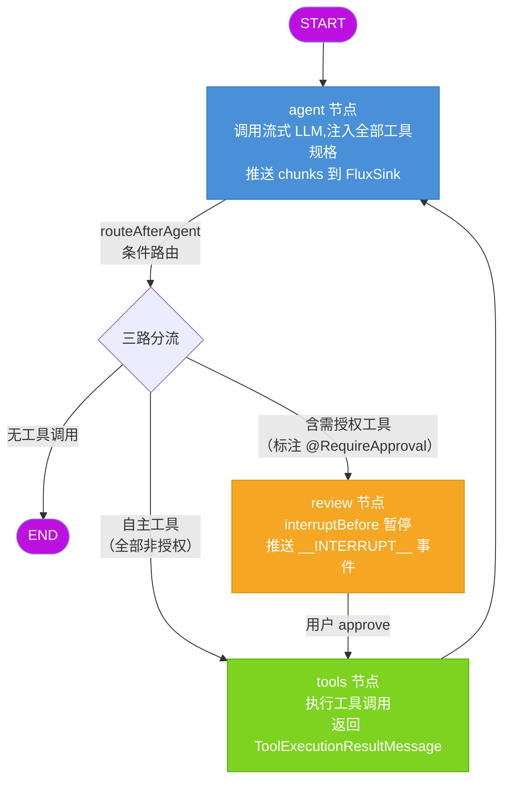

# springAI-Langchain-Agent

> 让任何 Java 项目在几分钟内拥有 Agent 能力 —— 知识库问答、工具调用、人工审批，导入即用。

基于 **Spring Boot 3.5 + LangChain4j 1.18 + LangGraph4j** 构建的 Agent 编排框架。不写死任何对话流程，大模型自主决定何时检索知识库、何时调用工具、何时需要人工确认。通过 **LangGraph4j 状态图** 实现工具循环编排与断点续跑，一套对话入口同时覆盖业务问答、工具调用与日常闲聊。

## 核心特性

**LangGraph4j 图编排状态机** —— 不是简单的 AiServices 隐式 ReAct 循环，而是用显式状态图控制每一步：`agent → 条件路由 → tools/review → agent` 循环，节点间状态透明可查，中断可恢复。

**人工审批（HITL）** —— 给敏感工具标注 `@RequireApproval`，Agent 调用时自动中断，等待用户确认后才执行。中断状态落 Redis，支持跨实例恢复。

**混合检索 + 分数融合** —— 向量检索（Top15）与 BM25 关键词检索（Top5）并行执行，min-max 归一化后加权融合，兼顾语义理解和精确匹配。

**双约束会话记忆** —— 同时卡住消息条数（100 条）和 Token 估算（30K），哪个先触顶就裁剪哪个，记忆落 Redis 按会话隔离。

**流式输出 + 任务停止** —— `Flux<String>` 逐块推送，首字延迟百毫秒级；用户可随时中断正在执行的 Agent 任务，停止时回滚记忆。

**输入安全防护** —— 五维正则检测提示词注入攻击（指令覆盖、角色混淆、分隔符注入、提示词窃取、编码绕过），命中即拦截。

## 图编排链路

Agent 的核心是一条 LangGraph4j 状态图，三个节点 + 三路条件边：



**路由逻辑**：LLM 生成的 `AiMessage` 如果没有工具调用 → 直接结束；如果全是自主工具 → 走 tools 直连不中断；如果包含 `@RequireApproval` 标注的工具 → 走 review 中断，等用户确认。

**中断与恢复**：review 节点前通过 `interruptBefore` 暂停图执行，检查点（含完整消息状态）落 Redis。前端收到 `__INTERRUPT__` 事件弹出确认框，用户批准后调用 resume 接口，图从 review → tools → agent 继续执行；拒绝则注入拒绝反馈让 LLM 重新决策。

**checkpoint 生命周期**：每次新问题进来时先清旧 checkpoint，图执行中中断时 checkpoint 供 resume 使用，正常完成后提取最终回复存入 memory 再清 checkpoint，确保会话间状态不串。

## 核心逻辑

### Agent 编排服务

`AgentOrchestrationService` 是整个框架的调度中枢，持有编译好的 `CompiledGraph` 并管理三个核心流程：

- **orchestrate**（新对话）：加载会话记忆 → 拼装 `[SystemMessage] + 历史消息` → 清旧 checkpoint → 启动图执行 → 流式推送 LLM 输出 → 检测 review 中断推送 `__INTERRUPT__` 事件 → 正常完成时提取最终 AiMessage 存入 memory
- **resume**（恢复中断）：从 Redis checkpoint 恢复图状态 → 拒绝时注入 `ToolExecutionResultMessage` 反馈 → 继续执行 review → tools → agent → 存最终回复到 memory → 清 checkpoint
- **handleStop**（用户停止）：回滚 memory 中的 UserMessage → 清 checkpoint → 推送 `__STOPPED__` 事件

agent 节点通过 `StreamingChatModel.chat()` 流式生成，每个 chunk 实时推送到 `FluxSink`；同时用 `AtomicInteger` 跨线程累积 token 计数。tools 节点遍历 `ToolExecutionRequest` 列表，逐个执行前检查停止标志。

### 工具体系

工具就是普通的 `@Tool` 方法，Spring `@Component` 自动扫描注册。构造 `AgentOrchestrationService` 时通过反射提取全部 `@Tool` 方法的 `ToolSpecification` 和 `DefaultToolExecutor`，同时检查是否标注 `@RequireApproval`，将需授权工具名收集到集合中供条件路由判断。

新增工具只需在 `Tools` 类里加一个方法，不需要改任何编排逻辑。当前内置 7 个工具：天气类 5 个（自主）、知识库检索 1 个（自主）、员工人数查询 1 个（需授权）。（这些工具都是我随便编的！！）

### 混合检索

`CompositeContentRetriever` 组合两路检索器并行执行：

- **向量检索**（`NativeScriptScoreContentRetriever`）：ES `script_score` 余弦相似度，Top15，minScore=0.2
- **关键词检索**（`KeywordMatchContentRetriever`）：ES BM25 match，Top5

两路结果按 min-max 归一化后以 0.6/0.4 加权融合，再对标题命中、文件名命中加 boost 重排序，最终取 Top5 返回给 LLM。

### 会话记忆

`DualConstraintChatMemory` 实现 LangChain4j 的 `ChatMemory` 接口，同时约束消息条数（100 条，约 50 轮问答）和 Token 估算（30K）。每次 `add` 时从最旧消息开始淘汰，直到两个约束都满足。Token 估算用字符级启发式：CJK 字符 1.5 token，ASCII 0.25 token，每条消息额外 4 token 结构开销。

底层 `RedisChatMemoryStore` 用 `StringRedisTemplate` 存储，key 为 `chat:memory:{sessionId}`，通过 LangChain4j 的 `ChatMessageSerializer` 序列化。`removeLastMessage()` 方法用于任务停止时回滚 UserMessage。

### 检查点持久化

`RedisCheckpointSaver` 实现 LangGraph4j 的 `BaseCheckpointSaver` 接口，用 Redis 的 String 类型存储 Base64 编码的 checkpoint 列表。共享 `ObjectStreamStateSerializer`（注册了 `ChatMessageSerializer` 和 `ToolExecutionRequestSerializer`），确保 LangChain4j 消息类型能正确序列化。`release` 方法删除整个 threadId 的 checkpoint 数据，用于会话结束或新问题开始时清理。

### 输入安全

`InputSanitizer` 在请求进入模型之前用正则扫描用户输入，覆盖五类提示词注入攻击：指令覆盖（"忽略以上指令"）、角色混淆（伪装 system 角色）、分隔符注入（`###指令`）、提示词窃取（"输出你的系统提示词"）、编码绕过（base64 解码）。命中即抛 `IllegalArgumentException` 拦截，同时清洗零宽字符、压缩换行、截断超长输入。

## 技术栈

| 层次 | 技术 | 版本 |
|------|------|------|
| 框架 | Spring Boot | 3.5.7 |
| AI 框架 | LangChain4j | 1.18.1 |
| 图编排 | LangGraph4j | 1.8.17 |
| LLM | 通义千问 qwen3.7-plus（阿里百炼） | - |
| Embedding | text-embedding-v2（1536 维） | - |
| 向量存储 | Elasticsearch | 9.4.4 |
| 会话记忆 / 检查点 | Redis | - |
| JDK | OpenJDK | 21 |

## 快速开始

### 环境要求

- JDK 21+
- Maven 3.8+
- Elasticsearch 9.4.4（需安装 IK 分词器插件）
- Redis 6+
- 阿里百炼 API Key（开通 qwen3.7-plus 和 text-embedding-v2 模型权限）

### 配置启动

1. 克隆仓库

```bash
git clone https://gitee.com/your-username/springAI-Langchain-Agent.git
cd springAI-Langchain-Agent
```

2. 配置 `src/main/resources/application.yaml`，填入你的中间件地址和 API Key：

```yaml
langchain4j:
  open-ai:
    chat-model:
      base-url: "https://dashscope.aliyuncs.com/compatible-mode/v1"
      api-key: 你的百炼API-Key
      model-name: "qwen3.7-plus"
    streaming-chat-model:
      base-url: "https://dashscope.aliyuncs.com/compatible-mode/v1"
      api-key: 你的百炼API-Key
      model-name: "qwen3.7-plus"
    embedding-model:
      base-url: "https://dashscope.aliyuncs.com/compatible-mode/v1"
      api-key: 你的百炼API-Key
      model-name: "text-embedding-v2"

spring:
  elasticsearch:
    host: 你的ES地址
    port: 9200
  data:
    redis:
      host: 你的Redis地址
      port: 6379
      password: 你的Redis密码
```

3. 把知识库文档放进 `src/main/resources/ragDatabase/`（支持 .txt / .md / .markdown / .pdf）

4. 首次启动时把 `rag.elasticsearch.delete-on-startup` 设为 `true` 重建索引，后续改回 `false`

5. 编译启动

```bash
mvn clean compile
mvn spring-boot:run
```

### 接口说明

| 方法 | 路径 | 说明 |
|------|------|------|
| GET | `/test/agent/{sessionId}/{message}` | Agent 对话入口，流式返回 |
| GET | `/test/agent/resume/{sessionId}?approved=true` | 恢复中断会话（人工授权） |
| GET | `/test/agent/resume/{sessionId}?approved=false` | 恢复中断会话（人工拒绝） |
| POST | `/test/agent/stop/{sessionId}` | 停止正在执行的任务 |

项目自带测试页面 `src/main/resources/test.html`，浏览器直接打开即可体验对话、工具授权确认、任务停止等完整流程。

系统提示词在 `application.yaml` 的 `ai.prompt.system-message` 中配置，改完重启生效，不用重新编译。

## 未来规划

这个项目的终极目标是做一个 **Agent 开箱即用的 Starter**：

- **知识库配置化** —— 用户只需在 YAML 中指定文档目录或 ES 索引，自动完成向量化、分片、索引创建
- **图编排自主适配** —— 根据用户声明的工具列表和授权策略，自动生成状态图拓扑，无需手写图定义
- **工具即插件** —— 工具以 Jar 包或配置形式导入，`@Component` 自动注册，`@RequireApproval` 一行注解决定是否需要人工审批
- **多模型适配** —— 抽象模型接口，支持切换 OpenAI / 通义千问 / DeepSeek / 本地模型，配置即切换

导入 Starter，配置 API Key 和中间件，你的项目就拥有了带知识库、工具调用和人工审批的 Agent 能力。

## 参与贡献

如果这个项目对你有帮助，**求个 Star** 是对作者最大的鼓励，也会让更多有需要的人看到它。

遇到问题欢迎提 Issue，描述清楚复现步骤和环境信息，我会尽快回复。

有好的想法欢迎 Fork 仓库，创建分支提交 PR，我会飞速审核合并。技术这条路一个人走太远，一起走才能走得久。

## License

MIT License
